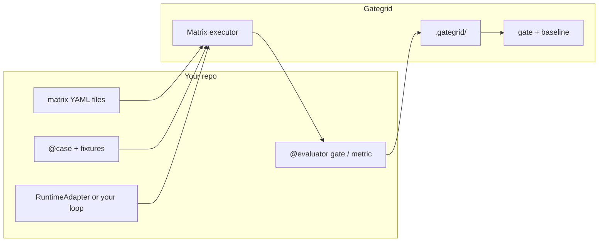

# Gategrid

**Matrix evaluation for LLM agents — pytest for your cases, codecov for your regressions.**

Python ≥3.11 · install from this repo (`uv sync` / `pip install -e .`) — **PyPI publish pending** · [Architecture](docs/roadmap/engineering/architecture-vision.md)

**More:** [Extended product brief](docs/roadmap/product/README-pitch-draft.md) · [Battlecard](docs/roadmap/product/battlecard.md) · [Competitive landscape](docs/roadmap/product/competitive-landscape.md) · [Spike DX analysis](docs/roadmap/research/spike-dx-competitive-analysis.md) · [v1 checklist](docs/roadmap/engineering/v1-implementation-checklist.md)

### Works today · next

| | |
| - | - |
| **Works today** | `validate` · `run` · `gate` · `baseline update`; `@case` · `@evaluator` · `RuntimeAdapter`; `.gategrid/` reports and per-profile baselines; `contrib/file_edit` and MCP example trees; OpenCrabs hashline dogfood ([examples/opencrabs/](examples/opencrabs/)); legacy `agent_eval_matrix` removed |
| **CI** | PR `gate`, `main` baseline artifact, `run.sample` — [docs/guides/ci.md](docs/guides/ci.md) · [Phase 5](docs/roadmap/engineering/v1-implementation-checklist.md#phase-5--ci-productization) |
| **Post-v1** | `gategrid init`, HTML report, marketplace GitHub Action — [Phase 6](docs/roadmap/engineering/v1-implementation-checklist.md#phase-6--post-v1-defer) |

This repo’s CI runs **pytest**, **ci-gate-mock** on PR, and **baseline refresh** on `main` via [`.github/workflows/gategrid-ci.yml`](.github/workflows/gategrid-ci.yml). Copy [`.github/workflows/gategrid.yml.example`](.github/workflows/gategrid.yml.example) or see [docs/guides/ci.md](docs/guides/ci.md).

---

## The problem

Building an agent is only half the work. You still need to know whether a new prompt, tool surface, model, or MCP server build **actually helps** — and whether yesterday’s change **broke** last week’s behavior on **your** stack.

Most teams end up with:

- One-off scripts that don’t compose
- Benchmarks tied to a single agent framework
- CI that runs evals but **doesn’t gate** regressions
- Baselines that mix unrelated profiles or PR envs, so “pass rate vs main” lies

**Gategrid** is the shared runner: you bring cases, runtime, and scorers in **your eval tree**; it runs the grid, stores artifacts only under `.gategrid/`, and compares runs to **git-friendly golden baselines** for one gated profile at a time.

---

## What it is (and isn’t)

| It is | It isn’t |
| ----- | -------- |
| A **matrix runner** (`cases × profiles × models`) | An agent framework |
| **pytest-shaped** plugins (your code, our infra) | A hosted eval SaaS |
| **Single-profile CI gates** + one baseline file per lane | A mandatory multi-profile fleet baseline |
| **CLI-first** (`run`, `gate`, `baseline update`; PR never updates baseline) | Direct MCP protocol tests without an LLM |
| **Git-native golden runs** (codecov-style) | promptfoo / LangSmith-style cloud baselines only |

Think **pytest** plus **codecov-style** compare to a stored golden run — for one stack at a time in CI, with optional **benchmark** matrices when you want to compare many profiles on the same cases.

File-edit sandboxes and MCP helpers live in **[contrib](src/gategrid/contrib/README.md)**, not in core — you can run matrices without them.

---

## Gate vs benchmark (two jobs)

| | **Gate (CI default)** | **Benchmark (optional)** |
| - | --------------------- | ------------------------ |
| **Question** | Did **our** stack regress? | Which stack is best? |
| **Profiles per run** | **One** per gate matrix | Many (A/B tool surfaces) |
| **Baseline** | `.gategrid/baselines/<profile>.json` | Report only; no PR gate |
| **`baseline update`** | **`main` / nightly** only, full case grid | Not used for gating |

PR and `main` should use the **same profile** and the **same baseline file**. Overall and like-for-like comparisons stay honest. Full gate YAML, sampling, and CI recipes: [docs/guides/ci.md](docs/guides/ci.md) and [README-pitch-draft.md](docs/roadmap/product/README-pitch-draft.md).

---

## You write · we run



| You own | Framework owns |
| ------- | ---------------- |
| Cases, runtime, evaluators, matrix YAML under your tree | Grid expansion, retries, traces |
| **Several matrix files** per repo (`smoke`, `mcp-gate`, `benchmark`, …) | Reports, **one baseline file per gate lane** |
| **One profile** in each gate matrix | `gategrid gate`, `baseline update` rules |

Pass `--root` (or `GATEGRID_EVAL_ROOT`) when the eval tree is not the repo root — e.g. [examples/gategrid/](examples/gategrid/) or [examples/opencrabs/](examples/opencrabs/).

**Secrets:** values in process env only; YAML names `api_key_env` / `env_pass_through`, never secret values.

---

## Why teams use it

- **One profile per gate** — PR and `main` compare against the same `baselines/<profile>.json`, not a mixed fleet baseline.
- **Regression gate in the CLI** — `run` produces a report; `gate` checks overall and like-for-like vs baseline; `baseline update` refreshes the golden run on `main` only.
- **Three layers of pass** — cell (`gate` evaluators), regression (vs baseline), optional hard limits on this run (matrix `gate.limits` — examples in pitch draft).
- **Bring your stack** — `RuntimeAdapter`, optional `gategrid[pydantic-ai]`, optional `gategrid[mcp]`, optional [contrib](src/gategrid/contrib/README.md) (file-edit sandbox, MCP profile helpers, LLM-judge base class).

**PR sampling:** `run.sample` in matrix YAML (`max_cells`, `share`, `always_include_tags`) — see [docs/guides/ci.md](docs/guides/ci.md) and `examples/gategrid/matrices/ci-gate-pr-mock.yaml`.

---

## Try it (no API key)

From a clone:

```bash
git clone https://github.com/leshchenko1979/gategrid.git
cd gategrid
uv sync --extra dev

# Matrix run (default eval root: parent of matrices/)
uv run gategrid validate --matrix examples/gategrid/matrices/smoke.yaml
uv run gategrid run --matrix examples/gategrid/matrices/smoke.yaml

# Golden baseline + gate (use the report path printed by run)
uv run gategrid baseline update --from-report .gategrid/reports/<report-from-run-output> --profile demo
uv run gategrid gate --profile demo
```

Artifacts live under `.gategrid/reports/` and `.gategrid/baselines/` (`GATEGRID_HOME` overrides). Partial runs: `--case <id>` (gate may warn on fingerprint mismatch).

**MCP mock (offline):**

```bash
uv sync --extra dev --extra pydantic-ai --extra mcp
uv run gategrid validate --matrix examples/gategrid/matrices/mcp-gate-mock.yaml --root examples/gategrid
uv run gategrid run --matrix examples/gategrid/matrices/mcp-gate-mock.yaml --root examples/gategrid
```

**CI gate (mock, offline):**

```bash
uv run gategrid validate --matrix examples/gategrid/matrices/ci-gate-mock.yaml --root examples/gategrid
uv run gategrid run --matrix examples/gategrid/matrices/ci-gate-mock.yaml --root examples/gategrid
```

See [examples/gategrid/README.md](examples/gategrid/README.md) for layout, PR sampling (`ci-gate-pr-mock`), baseline regen, and live `mcp-gate` (requires `OPENAI_API_KEY`).

---

## MCP evaluations

LLM-mediated E2E over **your** MCP server (stdio subprocess or remote HTTP). Gategrid does not run docker, databases, or product side effects — you start the MCP process and own secrets.

| Install | Use when |
| ------- | -------- |
| `pip install "gategrid[pydantic-ai,mcp]"` | Path A: pydantic-ai agent + MCP toolsets (example adapter) |
| `pip install "gategrid[mcp]"` | Path B: your adapter + official MCP SDK (or another client) |

MCP connection settings live in **`profile.data.mcp`** (not a core profile field). Helpers: `gategrid.contrib.mcp.mcp_from_profile`, `resolve_env_pass_through` for `data.env_pass_through` **names** only.

```python
from gategrid import case, evaluator
from gategrid.contrib.mcp import mcp_from_profile

# In your RuntimeAdapter.execute:
# mcp_cfg = mcp_from_profile(ctx.profile)
# Path A: mcp_toolset_from_data(...) + run_agent(toolsets=[...])
# Path B: your MCP client + agent loop → RunArtifact
```

```bash
uv sync --extra dev --extra pydantic-ai --extra mcp
export OPENAI_API_KEY=...
gategrid run --matrix examples/gategrid/matrices/mcp-gate.yaml --root examples/gategrid
```

---

## Example (Python-first)

```python
from gategrid import case, evaluator

@case(tags=["smoke"], data={"user_prompt": "Create a standup tomorrow 9am"})
def create_event() -> None:
    pass  # prompt in case data; adapter runs the agent loop

@evaluator(role="gate")
def event_created(ctx, artifact):
    return artifact.metrics.get("calendar_write_ok")
```

```bash
gategrid run --matrix examples/gategrid/matrices/smoke.yaml
```

---

## Case study: OpenCrabs hashline

Dogfood for **gate** and **benchmark** personas: five profile variants × ten file-edit cases (hashline protocol hypotheses vs a reference stack).

| Artifact | Path |
| -------- | ---- |
| Gate matrix | [examples/opencrabs/matrices/hashline-gate.yaml](examples/opencrabs/matrices/hashline-gate.yaml) — one profile, `gate.baseline`, regression bounds |
| Bench matrix | [examples/opencrabs/matrices/hashline-bench.yaml](examples/opencrabs/matrices/hashline-bench.yaml) — multi-profile, no PR gate |
| Report write-up | [docs/reports/hashline/hashline_hypothesis_report.md](docs/reports/hashline/hashline_hypothesis_report.md) |
| Charts | [docs/reports/hashline/hashline_hypothesis_report.ipynb](docs/reports/hashline/hashline_hypothesis_report.ipynb) |
| Repro | [examples/opencrabs/README.md](examples/opencrabs/README.md) — gate vs bench, baseline, CI tiers |

```bash
uv sync --extra dev --extra pydantic-ai
gategrid validate --matrix examples/opencrabs/matrices/hashline-smoke.yaml --root examples/opencrabs
gategrid run --matrix examples/opencrabs/matrices/hashline-smoke.yaml --root examples/opencrabs
# Gate / bench: MINIMAX_API_KEY — examples/opencrabs/README.md
```

---

## Who it’s for

| Role | Typical use |
| ---- | ----------- |
| **MCP / tool authors** | Gate one candidate profile on shared cases before release |
| **Agent engineers** | Same gate matrix locally and in CI |
| **Platform / QA** | PR `gate` vs `baselines/<profile>.json`; `main` updates baseline |
| **Researchers** | Optional `benchmark` matrix with many profiles — reports only |

---

## How we compare

Gategrid is a **thin git-native regression gate** for one agent stack at a time — not a hosted experiment browser or red-team suite.

| | Gategrid | [promptfoo](https://github.com/promptfoo/promptfoo) | [DeepEval](https://github.com/confident-ai/deepeval) |
| - | -------- | --------------------------------------------------- | ---------------------------------------------------- |
| **CI regression** | One profile, **git** baseline file | Pass-rate / Action compare; cloud share common | Pytest pass; regression UI → Confident AI |
| **Agent runtime** | Pluggable `RuntimeAdapter` | Providers + custom JS | Bring your app |
| **Matrix** | Gate vs benchmark personas | Prompt × provider matrix | Datasets / metrics |

Detail: [docs/roadmap/product/battlecard.md](docs/roadmap/product/battlecard.md) · [docs/roadmap/product/competitive-landscape.md](docs/roadmap/product/competitive-landscape.md).

---

## Install

From a clone (recommended until [PyPI publish](docs/roadmap/engineering/v1-implementation-checklist.md#rename--publish)):

```bash
uv sync --extra dev
# or: pip install -e ".[dev]"
```

Optional extras (same names when published):

```bash
uv sync --extra pydantic-ai              # LLM runtime (pydantic-ai)
uv sync --extra pydantic-ai --extra mcp  # MCP toolsets (pydantic-ai path)
uv sync --extra mcp                      # MCP SDK only (bring-your-own adapter)
```

Python ≥3.11. Secrets via environment only.

---

## Contributing and development

Monorepo layout:

| Path | Role |
| ---- | ---- |
| [src/gategrid/](src/gategrid/) | Framework (`cli`, executor, gate, `contrib/`, `integrations/`) |
| [examples/gategrid/](examples/gategrid/) | Smoke, MCP gate (mock/live), CI gate (`ci-gate-mock`) |
| [examples/file_edit/](examples/file_edit/) | `contrib/file_edit` sample |
| [examples/opencrabs/](examples/opencrabs/) | Hashline hypothesis dogfood (Spike C) |
| [schemas/v1/](schemas/v1/) | Frozen report/baseline/matrix JSON schemas |

Operator setup: [CLAUDE.md](CLAUDE.md). Coding principles: [CODE.md](CODE.md). Build status: [v1-implementation-checklist.md](docs/roadmap/engineering/v1-implementation-checklist.md).

```bash
uv sync --extra dev
uv run pytest tests/
uv run gategrid validate --matrix examples/gategrid/matrices/smoke.yaml
```

---

## License

See [LICENSE](LICENSE).
