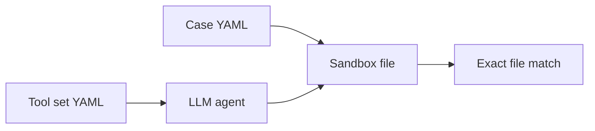
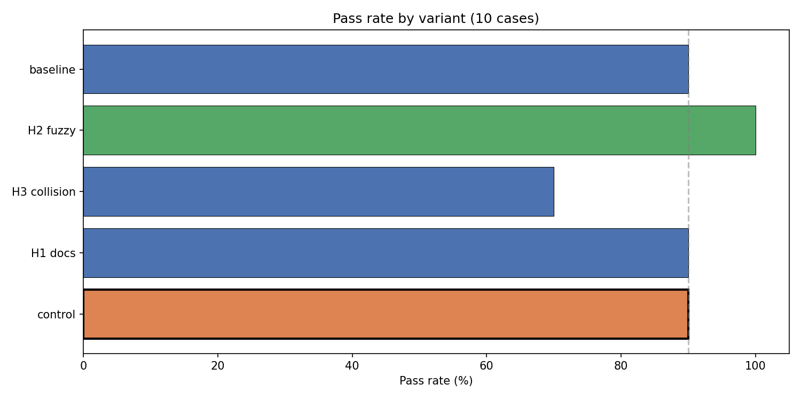
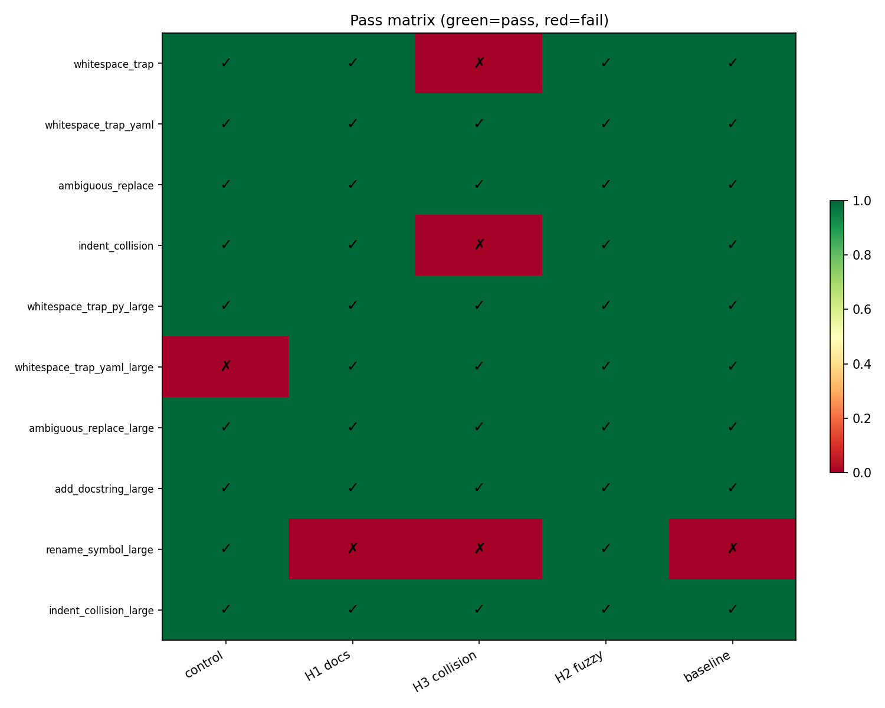
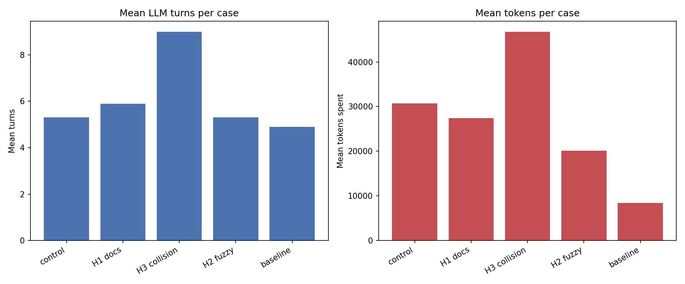
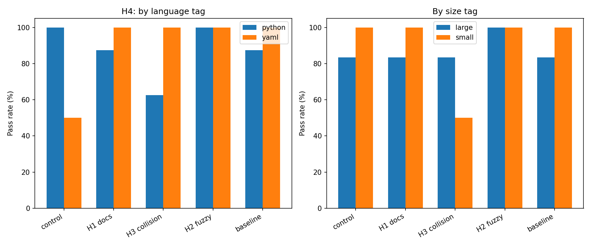

# Hashline edit evaluation — hypothesis results

External evaluation of OpenCrabs-style hashline tooling via a Python port in the `harness_test` repository. **OpenCrabs upstream was not consulted** before this study was designed or run.

**Artifacts:** this document, [interactive charts](hashline_hypothesis_report.ipynb), and raw matrix output [`reports/2026-05-23T13-22-35.666225+00-00_local-r_matrix.json`](../reports/2026-05-23T13-22-35.666225+00-00_local-r_matrix.json) (50 runs, `minimax-m2.7`).

**How to read:** background (what hashline is) → hypotheses → methodology → corpus → results → interpretation.

---

## 1. Introduction

### Who ran this

Researchers integrated OpenCrabs tools into `harness_test`—a matrix evaluation harness for LLM file-editing agents—to test four specific beliefs about `hashline_edit` and `read_file` behavior observed while porting Rust tooling to Python. This report is a **post-hoc summary** for OpenCrabs developers; it is **not** a merged change proposal or a Rust implementation audit.

### Why it exists

During porting, we noticed:

- Tool descriptions referring to line-number IDs while read output uses content hashes.
- Collision lines marked as `COLLISION|…` when duplicate line hashes occur.
- A possible alternative: fuzzy line-block `str_replace` instead of hash-anchored edits.
- A suspicion that indented Python and YAML fare worse with the hashline stack than with plain search/replace.

We designed isolated tool-set variants—one change per hypothesis—and measured whether each improved end-to-end edit success.

### What this document is / is not

| Is | Is not |
|----|--------|
| Reproducible eval report with methodology and results | Product sign-off for OpenCrabs |
| Behavioral evidence from a Python port aligned with Rust hashline | Multi-model benchmark or CI gate |
| Input for upstream docs/protocol decisions | Proof that Rust production code matches the port byte-for-byte |

### Artifacts

- **Report (prose):** this file
- **Charts:** [hashline_hypothesis_report.ipynb](hashline_hypothesis_report.ipynb)
- **Data:** matrix JSON under `reports/` (canonical run cited above)

---

## 2. Executive summary

| ID | Hypothesis | Verdict | Headline |
|----|------------|---------|----------|
| **H1** | Fixing docs to describe `HASH\|content` (not line numbers) improves success | **Inconclusive** | 9/10 pass—same as control; gained `whitespace_trap_yaml_large`, lost `rename_symbol_large` |
| **H2** | Fuzzy 4-pass `str_replace` beats `edit_file` + `hashline_edit` | **Supported** | **10/10**—only variant with a perfect score; best large-file pass rate |
| **H3** | Showing collisions as `  \|line` instead of `COLLISION\|line` on read improves success | **Rejected** | 7/10—worst OpenCrabs variant; 2/4 on small cases; highest mean turns and tokens |
| **H4** | Hashline stack is significantly worse than plain `str_replace` on indented `.py` / `.yml` | **Mixed** | 9/10 vs 9/10 overall; baseline uses far fewer tokens; not uniformly worse on pass rate |

**Bottom line:** Align user-facing docs with actual `HASH|content` format (low risk, modest gain). **Do not** adopt the empty-hash collision read format without further agent testing. Explore **fuzzy line-block replace** (H2) as a complement to hashline. Hashline is not universally inferior to `str_replace`, but collision handling and large YAML edits remain weak spots for the control stack.

---

## 3. Background: hashline in OpenCrabs

### Read path

With `read_file(..., hashline=true)`, each line is shown as:

```text
{2-char-content-hash}|{line text}
```

The hash is derived from the line bytes (FNV-1a style, 2-character alphabet)—not from a stable line number. The agent is expected to use these hashes when calling `hashline_edit`.

### Edit path

`hashline_edit` applies batch operations anchored by hash references (e.g. `VK` or `VK|line text`). If file content changed since read, stale hashes are rejected before edits apply.

### Collisions

When two or more lines share the same content hash, the control read formatter marks them as `COLLISION|{line}` and appends a warning that those lines cannot be edited via `hashline_edit` (use `edit_file` / search-replace instead).

### Doc mismatch (motivates H1)

Ported tool schemas and prompts historically described anchors like `LINE#ID` (line number + hash). That does not match `HASH|content` output. H1 tests whether correcting descriptions alone helps agents.


---

## 4. Hypotheses H1–H4

Each variant changes **at most one** dimension vs `opencrabs_original` (control). Success = higher **pass rate** on targeted cases vs control (see §5).

### H1 — Documentation vs implementation

| Field | Description |
|-------|-------------|
| **Claim** | Docs that mention line numbers mislead agents; describing `HASH\|content` will improve results. |
| **Change** | `opencrabs_h1_docs`: updated system prompt and tool docstrings only—**no code path change**. |
| **Success criterion** | Pass rate increases vs control on indent- and collision-related cases. |
| **Cases** | `whitespace_trap`, `whitespace_trap_py_large`, `indent_collision`, `indent_collision_large`, `add_docstring_large` |

### H2 — Fuzzy line-block replace

| Field | Description |
|-------|-------------|
| **Claim** | Replacing `edit_file` + `hashline_edit` with a 4-stage fuzzy `str_replace` improves editing outcomes. |
| **Change** | `opencrabs_h2_fuzzy`: keeps explore/read tools; uses `str_replace_fuzzy` (exact → trim end → trim both → Unicode normalize line matching). |
| **Success criterion** | Pass rate ≥ control, especially on ambiguous and rename tasks. |
| **Cases** | `ambiguous_replace`, `ambiguous_replace_large`, `rename_symbol_large`, `add_docstring_large` |

### H3 — Collision display format

| Field | Description |
|-------|-------------|
| **Claim** | `  \|{line}` (empty hash) on read is clearer than `COLLISION\|{line}` and improves results. |
| **Change** | `opencrabs_h3_collision`: only `opencrabs_h3/read_file.py` sets `collision_format="empty_hash"`; edit validation unchanged. |
| **Success criterion** | Pass rate increases vs control on `indent_collision*`. |
| **Cases** | `indent_collision`, `indent_collision_large` |
| **Isolation** | Separate `read_file` module so matrix loader does not leak collision format into other variants in-process. |

### H4 — Indented Python and YAML

| Field | Description |
|-------|-------------|
| **Claim** | The full hashline tool stack is significantly worse than harness `str_replace` on indented `.py` and `.yml`. |
| **Change** | None—compare all `opencrabs_*` variants to `baseline` (plain `str_replace` only). |
| **Success criterion** | Lower pass rate for `opencrabs_*` than `baseline` on cases tagged `language:python` or `language:yaml` with `indented`. |
| **Cases** | `whitespace_trap`, `whitespace_trap_yaml`, `whitespace_trap_py_large`, `whitespace_trap_yaml_large` |

---

## 5. Methodology

### Harness flow



- **Case:** natural-language instruction, starting file, golden expected file content.
- **Variant:** tool set + model preset.
- **Pass/fail:** after the agent finishes, the workspace file must **match `expected_output` exactly** (byte-level). No partial-credit rubric.
- **Matrix:** every variant × every case in the suite.

### Suite

| Parameter | Value |
|-----------|--------|
| Suite | `experiments/suites/hashline_hypotheses.yaml` |
| Variants | 5 tool sets × 1 model (`minimax-m2.7`) |
| Cases | 10 |
| Runs | **50** |
| Control | `opencrabs_original` |

### Isolation

| Variant | Single change |
|---------|----------------|
| `opencrabs_original` | Control (default OpenCrabs bundle) |
| `opencrabs_h1_docs` | Prompt + docstrings |
| `opencrabs_h2_fuzzy` | Fuzzy replace instead of `edit_file` / `hashline_edit` |
| `opencrabs_h3_collision` | Empty-hash collision read format |
| `baseline` | Harness `str_replace` only (H4 reference) |

No combined “best of” champion variant.

### Metrics

| Metric | Role |
|--------|------|
| `passed` | **Primary** — hypothesis accept/reject |
| `turns` | Secondary — retry / cost proxy |
| `tokens_spent` | Secondary — cost proxy |
| `tool_failures` | Secondary — tool error rates |
| Case `tags` | Subgroup analysis only (language, size) |

### Python port caveat

Tools under `experiments/tooling/opencrabs/` mirror OpenCrabs behavior (hash alphabet, read formatting, collision warnings). Conclusions inform **UX, docs, and protocol**; re-validate in Rust before shipping upstream.

### Pilot

An earlier 4-case pilot (20 runs) informed case expansion; **all numbers in this report are from the final 50-run matrix** only.

### Threats to validity

- Single model and provider.
- Cases authored by eval designers, not OpenCrabs.
- Pass criterion ignores nearly-correct edits.
- No pre-registration with upstream.

---

## 6. Test corpus

| Case | Tags | Stresses |
|------|------|----------|
| `whitespace_trap` | python, indented | H1, H4 |
| `whitespace_trap_yaml` | yaml, indented | H4 |
| `ambiguous_replace` | python | H2 |
| `indent_collision` | python, indented, hash_collision | H1, H3 |
| `whitespace_trap_py_large` | python, indented, size:large | H1, H4 |
| `whitespace_trap_yaml_large` | yaml, indented, size:large | H4 |
| `ambiguous_replace_large` | python, size:large | H2 |
| `add_docstring_large` | python, size:large, problem:insert | H1, H2 |
| `rename_symbol_large` | python, size:large, problem:rename | H2 |
| `indent_collision_large` | python, indented, hash_collision, size:large | H1, H3 |

Large cases are ~100–150 lines with edit targets away from the top of the file.

---

## 7. Results





*Green = pass, red = fail. Control failed only `whitespace_trap_yaml_large`; H3 failed `whitespace_trap`, `indent_collision`, and `rename_symbol_large`.*





[Interactive notebook with summary table](hashline_hypothesis_report.ipynb)

### Pass matrix

| Case | control | H1 | H3 | H2 | baseline |
|------|---------|----|----|-----|----------|
| `whitespace_trap` | ✓ | ✓ | ✗ | ✓ | ✓ |
| `whitespace_trap_yaml` | ✓ | ✓ | ✓ | ✓ | ✓ |
| `ambiguous_replace` | ✓ | ✓ | ✓ | ✓ | ✓ |
| `indent_collision` | ✓ | ✓ | ✗ | ✓ | ✓ |
| `whitespace_trap_py_large` | ✓ | ✓ | ✓ | ✓ | ✓ |
| `whitespace_trap_yaml_large` | ✗ | ✓ | ✓ | ✓ | ✓ |
| `ambiguous_replace_large` | ✓ | ✓ | ✓ | ✓ | ✓ |
| `add_docstring_large` | ✓ | ✓ | ✓ | ✓ | ✓ |
| `rename_symbol_large` | ✓ | ✗ | ✗ | ✓ | ✗ |
| `indent_collision_large` | ✓ | ✓ | ✓ | ✓ | ✓ |

### Efficiency (means per variant)

| Variant | Pass | Avg turns | Avg tokens |
|---------|------|-----------|------------|
| `opencrabs_original` | 9/10 | 5.3 | 30,696 |
| `opencrabs_h1_docs` | 9/10 | 5.9 | 27,384 |
| `opencrabs_h2_fuzzy` | **10/10** | 5.3 | 20,115 |
| `opencrabs_h3_collision` | 7/10 | **9.0** | **46,785** |
| `baseline` | 9/10 | 4.9 | **8,412** |

---

## 8. Interpretation

### H1 — Documentation

**Result:** Inconclusive.

**Evidence:** 9/10 pass—tied with control. Versus control: **+** `whitespace_trap_yaml_large`, **−** `rename_symbol_large`.

**Failure mode:** On `rename_symbol_large`, the agent used `edit_file` repeatedly with `edit_file_succeeded` but left incorrect content—incomplete rename, not a hashline-specific bug.

**Upstream action:** Still align Rust/schemas/prompts to `HASH|content` and deprecate `LINE#ID` in user-facing text (keep parser backward-compatible). Expect modest impact; pair with tool-routing guidance.

### H2 — Fuzzy replace

**Result:** Supported.

**Evidence:** 10/10 pass; 6/6 on `size:large` cases; only variant to fix control’s `whitespace_trap_yaml_large` failure; lowest mean tokens among OpenCrabs-family variants.

**Upstream action:** Evaluate Codex-style fuzzy line-block matching as a complement or alternative for whitespace-sensitive and ambiguous replacements.

### H3 — Empty-hash collisions

**Result:** Rejected.

**Evidence:** 7/10 pass; **2/4** on small cases. Regressions vs control on `whitespace_trap` and `indent_collision`. Mean 9.0 turns and 46.8k tokens vs 5.3 and 30.7k for control.

**Failure mode:** Thrashing between `hashline_edit` and `edit_file` (e.g. 27 turns on `indent_collision`; `hashline_edit_failures` on several runs). “Quieter” collision display did not help agents.

**Upstream action:** Do **not** default to `  |` without parser and prompt changes. Prefer explicit `COLLISION|` or forbid `hashline_edit` on collision lines in instructions.

### H4 — vs baseline `str_replace`

**Result:** Mixed.

**Evidence:** Overall 9/10 for both control and baseline. Baseline uses far fewer tokens but fails the same `rename_symbol_large` case. Python-tagged: control 8/8, baseline 7/8. Only control failed large YAML.

**Upstream action:** Hashline is not uniformly worse on indented py/yaml in this model. Recommend scoped guidance: large structured YAML and collision lines → `edit_file` or fuzzy replace, not hashline_edit.

---

## 9. Recommendations for upstream

| Priority | Action |
|----------|--------|
| **High** | Align `read_file` / `hashline_edit` docs to `HASH\|content`; stop advertising line-number IDs in user-facing text |
| **High** | Do not ship empty-hash collision read format (`  \|`) without agent retesting |
| **Medium** | Explore fuzzy line-block replace (H2 winner) alongside hashline |
| **Medium** | Keep explicit collision markers or block `hashline_edit` on collision lines |
| **Low** | Replicate in Rust and additional models before production decisions |

**Not recommended:** Removing hashline entirely based on this eval (control still 9/10); claiming documentation fixes alone solve hashline UX.

---

## 10. Limitations, reproducibility, artifacts

### Limitations

- Single LLM (`minimax-m2.7`).
- Python port may diverge from Rust.
- Eval-authored cases; results may not generalize to production workloads.

### Reproduce

```bash
cd harness_test
python -m venv .venv && source .venv/bin/activate
pip install -e ".[report]"

# Re-run eval (requires MINIMAX_API_KEY in .env)
python -m harness.matrix run --suite experiments/suites/hashline_hypotheses.yaml

# Regenerate charts and notebook outputs
python docs/_build_report_viz.py
jupyter nbconvert --execute --to notebook docs/hashline_hypothesis_report.ipynb
```

### Artifacts

| File | Description |
|------|-------------|
| [`reports/2026-05-23T13-22-35.666225+00-00_local-r_matrix.json`](../reports/2026-05-23T13-22-35.666225+00-00_local-r_matrix.json) | Canonical 50-run output |
| [hashline_hypothesis_report.ipynb](hashline_hypothesis_report.ipynb) | Charts and summary table |
| `docs/figures/*.png` | Static figures embedded above |

Suite definition: `experiments/suites/hashline_hypotheses.yaml`. Harness overview: [`CLAUDE.md`](../CLAUDE.md).
