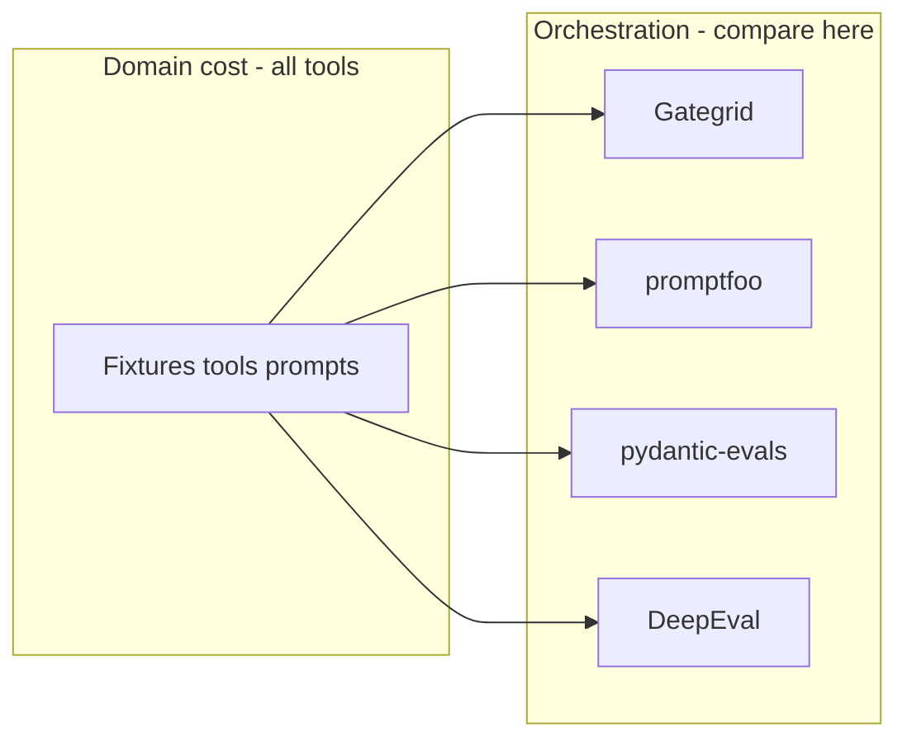

# Spike DX competitive analysis

**Status:** 2026-05-25 · mandatory for every dogfood spike before implementation sign-off and again at spike close.

**Purpose:** Compare **developer experience** and **time-to-results** against surveyed competitors for the *same* spike goals — not “which tool has more stars.” Separate **framework ceremony** from **code under test** (tools, fixtures, domain logic).

**Related:** [competitive-landscape.md](../product/competitive-landscape.md) · [battlecard.md](../product/battlecard.md) · [v1-implementation-checklist.md#dogfooding-spikes](../engineering/v1-implementation-checklist.md#dogfooding-spikes) · [dogfood-notes.md](dogfood-notes.md)

---

## When to run (gate)

| When | Action |
| ---- | ------ |
| **Spike kickoff** | Fill [Spike brief](#spike-brief-template) + estimate [three tasks](#three-comparison-tasks); record in [dogfood-notes.md](dogfood-notes.md). Block coding past smoke layout until brief exists. |
| **Spike close** | Update LOC table with **measured** Gategrid numbers; mark winners per task; note positioning implications for [battlecard.md](../product/battlecard.md) if objections changed. |
| **Checklist** | Each spike section in [v1-implementation-checklist.md](../engineering/v1-implementation-checklist.md) has a **DX-*** row tied to this doc. |

**Competitors in scope** (from [competitive-landscape.md](../product/competitive-landscape.md)):

| Tier | Tools |
| ---- | ----- |
| **Primary** | [promptfoo](https://github.com/promptfoo/promptfoo), [DeepEval](https://github.com/confident-ai/deepeval), [pydantic-evals](https://pypi.org/project/pydantic-evals/) |
| **MCP-shaped** | [mcp-eval](https://mcp-eval.ai/overview) (Spike A only) |
| **Platform** | Braintrust, LangSmith, Langfuse (note SaaS vs git-gate tradeoff; not full re-implementations) |

---

## Three comparison tasks

Use the same three tasks for every spike so results are comparable across OpenCrabs, ai-antispam, and fast-mcp-telegram.

| Task | Question | Success metric |
| ---- | -------- | -------------- |
| **A — First green cell** | How fast to one passing eval with **mock / no API key**? | Commands + ~LOC of *orchestration* (exclude domain tools) |
| **B — Full spike grid** | How fast to the spike’s target matrix (e.g. 5×10, N cases × M profiles)? | Orchestration LOC + YAML/config count; domain code counted separately |
| **C — Regression gate** | How do you block merge on regression afterward? | Git baseline, PR compare, CI story (honest “planned” if not shipped) |



**Rule:** Never claim “less code” for a spike without splitting **domain** vs **orchestration** rows in the LOC table.

---

## Line-count budget (Gategrid)

Measure from repo root at spike close (`wc -l` or `find … | xargs wc -l`). Round to nearest 10 for estimates at kickoff.

| Bucket | What counts | What does not |
| ------ | ----------- | --------------- |
| **Orchestration** | Adapter, matrices, profiles, models, eval-root `cases/` registration, custom `@evaluator` | — |
| **Domain** | Tool implementations, large fixtures, copied upstream code | — |
| **Framework (shared)** | `gategrid.contrib.*` used by spike — cite module, do not double-count per spike | Core `src/gategrid/` |

**Reference paths (Gategrid):**

| Path | Role |
| ---- | ---- |
| [examples/file_edit/](../../../examples/file_edit/) | Minimal file-edit smoke (builtin cases) |
| [examples/opencrabs/](../../../examples/opencrabs/) | Full hashline hypothesis dogfood |
| [src/gategrid/contrib/file_edit/](../../../src/gategrid/contrib/file_edit/) | Sandbox, batteries, `file_content_match` |

---

## Equivalent bench sketch (competitors)

Minimal *orchestration* to reproduce spike goals — not a full port of domain tools.

### Task A — one case, mock

| Tool | Sketch | Orchestration (order of magnitude) |
| ---- | ------ | ---------------------------------- |
| **Gategrid** | [examples/file_edit/matrices/smoke-mock.yaml](../../../examples/file_edit/matrices/smoke-mock.yaml) + `--root` | ~8 files; 0 case YAML if using builtins |
| **pydantic-evals** | `Dataset(cases=[Case(...)])` + `evaluate_sync(task)`; task returns expected output under mock | ~30–50 lines one `.py` |
| **promptfoo** | `providers: [file://provider.py]` + 1 test + `assert` | ~25 lines Python + ~15 lines YAML |
| **DeepEval** | `LLMTestCase` + `assert_test` — **you still run the agent elsewhere** | Harness LOC + ~20 lines test |
| **mcp-eval** | `@task` + mock agent — only if spike is MCP-native | ~40 lines if MCP |

### Task B — multi-profile matrix (file-edit pattern)

| Tool | Sketch | Typical winner |
| ---- | ------ | -------------- |
| **promptfoo** | One `call_api(prompt, options, context)`; `config.profile` selects tool list; matrix in [promptfooconfig.yaml](https://www.promptfoo.dev/docs/configuration/test-cases/) | **Declarative matrix**, `promptfoo view` |
| **pydantic-evals** | One task fn; [parameters](https://www.braintrust.dev/docs/evaluate/write-parameters) or Python loop over 5 tool configs | **Least Python packaging** if already on pydantic-ai |
| **Gategrid** | Matrix YAML × profiles × `RuntimeAdapter`; builtin `file_content_match` | **No custom scorer**; clear gate vs bench matrices |
| **DeepEval** | Pytest per scenario or `evaluate()` — agent harness is yours | **Slowest** for multi-turn tool E2E |
| **mcp-eval** | Dataset of MCP tasks | Spike A only |

### Task C — PR regression

| Tool | Sketch |
| ---- | ------ |
| **Gategrid** | `run` → `gate` vs `.gategrid/baselines/<profile>.json`; `baseline update` on `main` only |
| **promptfoo** | Thresholds / compare in [CI/CD](https://www.promptfoo.dev/docs/integrations/ci-cd/) — less “one golden file per profile” |
| **pydantic-evals** | Logfire / report diff — weaker git-native gate |
| **DeepEval** | `deepeval test run` + Confident AI for history |
| **Braintrust / LangSmith** | Cloud experiment regression — strong UI, weak air-gap git gate |

---

## Spike C — OpenCrabs (retroactive, 2026-05)

**Goals:** 5 profile variants × 10 file-edit cases; deterministic pass/fail on workspace file; optional `hashline-gate` regression.

### Measured Gategrid (orchestration vs domain)

| Bucket | LOC / files | Notes |
| ------ | ----------- | ----- |
| **Orchestration** | Adapter ~51; 15 YAML (~154 lines: matrices, profiles, models); 0 eval-root case YAML; 0 custom gate evaluators | Same adapter as [examples/file_edit/adapters/file_edit.py](../../../examples/file_edit/adapters/file_edit.py); case ids from [contrib batteries](../../../src/gategrid/contrib/file_edit/bundled/) |
| **Domain** | ~1,470 Python under [examples/opencrabs/tooling/](../../../examples/opencrabs/tooling/) only | **Hypothesis under test** — not Gategrid tax; 10 hashline case YAML live in contrib, not duplicated here |
| **Shared contrib** | ~600 under [src/gategrid/contrib/file_edit/](../../../src/gategrid/contrib/file_edit/) | Batteries + sandbox (all file-edit spikes) |

**Minimal Gategrid path for Task A:** [examples/file_edit/](../../../examples/file_edit/) — same adapter, builtin cases, 3 YAML files.

### Winners (OpenCrabs-shaped work)

| Task | Faster / less orchestration code | Caveat |
| ---- | ---------------------------------- | ------ |
| **A** | **Tie:** Gategrid `file_edit` smoke, **pydantic-evals** one-file Dataset | promptfoo comparable with Python provider |
| **B** | **promptfoo** or **pydantic-evals** (if agent already pydantic-ai) | OpenCrabs eval root is **tooling + profiles** (~1.5k LOC); cases are **contrib batteries** (same as `file_edit`) |
| **C** | **Gategrid** | Only competitor with first-class per-profile git baseline + `gate` CLI |

### Positioning takeaway

- Do **not** pitch [examples/opencrabs/](../../../examples/opencrabs/) as “minimal Gategrid” (no eval-root `cases/` since 2026-05-25 — builtins only).
- Pitch **`file_edit` smoke → your profiles/tools → bench matrix**; cite OpenCrabs as **proof** of a real 5×10 study.
- Battlecard honesty: for **bench-only** buyers on pydantic-ai, **pydantic-evals** may feel lighter; Gategrid wins **deterministic file gate + git golden runs**.

---

## Spike B — ai-antispam

**Repo:** [leshchenko1979/ai-antispam](https://github.com/leshchenko1979/ai-antispam) — LLM spam classifier for Telegram groups/channels (`is_spam`, rich `SpamClassificationContext`).

**Kickoff brief** (2026-05-25 — before B.1):

| Field | Value |
| ----- | ----- |
| Task A target | 1 `@case` + `mock` model; `matrices/spam-smoke.yaml`; label gate evaluator on `metrics` |
| Task B target | **~15** curated fixtures × **1** gate profile; optional bench **2** profiles (prompt variants), reports only |
| Task C target | `spam-gate.yaml`, `gate.baseline: classifier-candidate`, B.7 regression drill, CI when Phase 5 ships |
| Domain LOC estimate | **High** — reuse `app.spam.spam_classifier` + context builders; fixture JSON derived from existing `tests/` (not a full test port) |
| Orchestration LOC estimate | **~120** — `evals/adapters/classifier.py`, `cases/` package, 2 gate evaluators, 2–3 matrices, 1–2 profiles, 1 model YAML |

### Competitor sketch (Spike B)

| Task | Likely faster / less orchestration | Why |
| ---- | ------------------------------------ | --- |
| **A** | **DeepEval** or **pydantic-evals** | One `LLMTestCase` / `Case` + metric on label; no matrix tree |
| **B** | **DeepEval** if fixtures stay pytest files | `assert_test` loop over `tests/integration/test_spam_classifier.py`-style cases |
| **B** (alt) | **Gategrid** | Same fixture set × **multiple models** or profiles in one `run` |
| **C** | **Gategrid** | `gate` + `.gategrid/baselines/classifier-candidate.json` |

### Gategrid implementation map (B.1–B.9)

| Item | Plan |
| ---- | ---- |
| `evals/` layout | Standard tree under ai-antispam repo root |
| Cases | `@case` per fixture; data = message + context fields; tags `smoke` / `gate` |
| Adapter | `RuntimeAdapter` calling `is_spam`; mock short-circuit for Task A |
| Evaluators | `@evaluator(role="gate")` label match; optional `metric` for score/confidence |
| Matrices | `spam-smoke`, `spam-gate`, optional `spam-bench` |
| Contrib candidate | Classification helpers only if Spike A also needs them — else stay in repo |

**Close table** (fill at D.6):

| Task | Winner | Gategrid orchestration LOC | Notes |
| ---- | ------ | -------------------------- | ----- |
| A | | | |
| B | | | |
| C | | | |

---

## Spike A — fast-mcp-telegram

**Repo:** [leshchenko1979/fast-mcp-telegram](https://github.com/leshchenko1979/fast-mcp-telegram) — production Telegram MCP (stdio + HTTP-MTProto); multi-user bearer auth.

**Kickoff brief** (2026-05-25 — before A.1):

| Field | Value |
| ----- | ----- |
| Task A target | Mock/stub MCP smoke (pattern from [mcp-gate-mock.yaml](../../../examples/gategrid/matrices/mcp-gate-mock.yaml)); live policy: Saved Messages only, no prod spam |
| Task B target | **5–8** cases × **1** gate profile (`telegram-mcp-stdio`) × 1 model; optional 2nd profile for bench (HTTP vs stdio) |
| Task C target | `telegram-gate.yaml` + baseline; `workflow_dispatch` CI with secrets; depends Phase 5 for PR baseline artifact |
| Domain LOC estimate | **Zero in Gategrid** — server stays in fast-mcp-telegram; dogfood only adds `evals/` |
| Orchestration LOC estimate | **~150** — Path B adapter ([ADR 0006](../../adr/0006-gategrid-phase4-mcp-path.md)), cases, MCP profile YAML, 2 matrices |
| **mcp-eval** | Task A: `@task` + `Expect.tools.*` (~50–80 LOC) on live MCP; Task B: dataset + OTEL path analysis; no git baseline gate |

### Competitor sketch (Spike A)

| Task | Gategrid | mcp-eval | promptfoo |
| ---- | -------- | -------- | --------- |
| **A** | `mcp-gate-mock` clone under `evals/` | **Fastest** for “was tool X called?” | MCP provider + assert |
| **B** | Matrix × models; `RunArtifact` + evaluators | **Strong** trace/tool-sequence reports | YAML matrix, Python provider |
| **C** | **`gate` + git baseline** | CI exit codes; cloud/report focused | GitHub Action + thresholds |

### Gategrid implementation map (A.1–A.9)

| Item | Plan |
| ---- | ---- |
| MCP wiring | `gategrid.contrib.mcp` + Path B client loop (no pydantic-ai required) |
| Server | User starts fast-mcp-telegram (docker/stdio); `profile.data.mcp` points at command/url |
| Cases | Short prompts: list chats, read messages, optional dry-run send |
| CI | Secrets in repo settings; no full matrix on public PR until sampling/Phase 5 |

**Close table** (fill at D.7):

| Task | Winner | Gategrid orchestration LOC | mcp-eval LOC | Notes |
| ---- | ------ | -------------------------- | ------------ | ----- |
| A | | | | |
| B | | | | |
| C | | | | |

---

## Spike brief template

Copy into [dogfood-notes.md](dogfood-notes.md) at spike kickoff.

```markdown
### DX analysis kickoff — Spike <X>

- **Doc:** [spike-dx-competitive-analysis.md](spike-dx-competitive-analysis.md)
- **Task A:** …
- **Task B:** …
- **Task C:** …
- **Domain vs orchestration:** …
- **Expected Task B winner:** … (hypothesis)
- **Gategrid wedge for this spike:** …
```

---

## Decision log

| Date | Spike | Outcome |
| ---- | ----- | ------- |
| 2026-05-25 | C (retroactive) | Task A tie; B → promptfoo/pydantic-evals for bench orchestration; C → Gategrid. Doc created; checklist gates added. |
| 2026-05-25 | C (rewire) | Removed duplicate `examples/opencrabs/cases/yaml/`; matrices use builtin `hashline_hypotheses` / case ids. Domain LOC = tooling only (~1.5k). |
| 2026-05-25 | B (kickoff) | Task A → DeepEval/pydantic-evals; B → DeepEval or Gategrid (multi-profile); C → Gategrid. Recorded before B.1. |
| 2026-05-25 | A (kickoff) | Task A/B → mcp-eval for MCP assertions; C → Gategrid. Path B adapter; mock smoke first. |

---

## See also

- [README.md](../../../README.md) — product pitch; OpenCrabs as case study not minimal install
- [docs/reports/hashline/hashline_hypothesis_report.md](../../reports/hashline/hashline_hypothesis_report.md) — Spike C results
